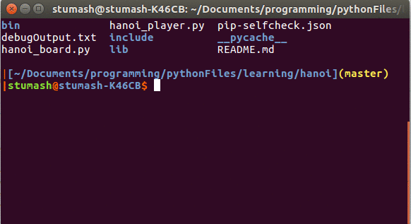

# hanoiSim

`hanoiSim` depends on `unicurses`, a python package that can be installed after download by running `python3 setup.py install` in the downloaded `unicurses` folder.  To run `hanoiSim`, run `python3 hanoi_player.py`.

